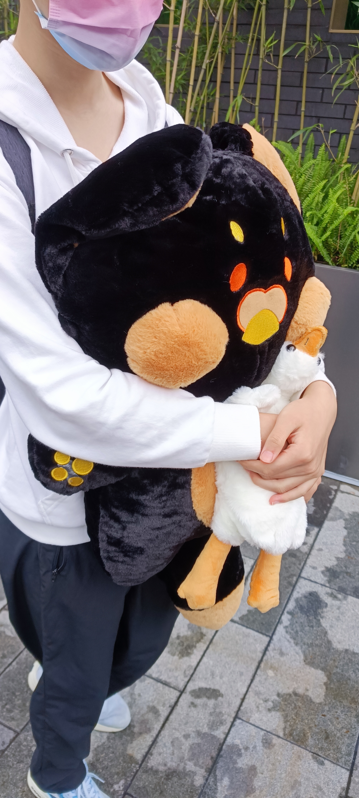

# 去成都找老公的计划！(实时编辑更新)

 

## Timeline || updated per max 24hours

#### 10.3 

1. 09:30 到达机场 首都机场T3 
2. 11:30 起飞 国航CA4120 
3. 14:35 落地 老公接到涵w 双流机场T2 
4. (剩下的事情忘写计划了但是都顺利完成了！)

#### 10.4

1. 12:30 起床
2. 14:30 烤鱼  
3. 逛街
4. 抓娃娃     
5. 7:00 见家长

### 10.5

1. 00:00 看电影
2. 00:20 带上了戒指！
 

## Todo

- 大熊猫基地
- 嘴对嘴喂吃的！（已完成）
- 认真的抱住和接吻（已完成）
- 在床上抱着睡觉（3/?）
- 一起看晚霞
- 一起手牵手逛街（1/?）
- 亲手给涵带上戒指！(已完成)
- 见家长（已完成）

# 好多都忘记更新了！行程已结束，一切顺利！